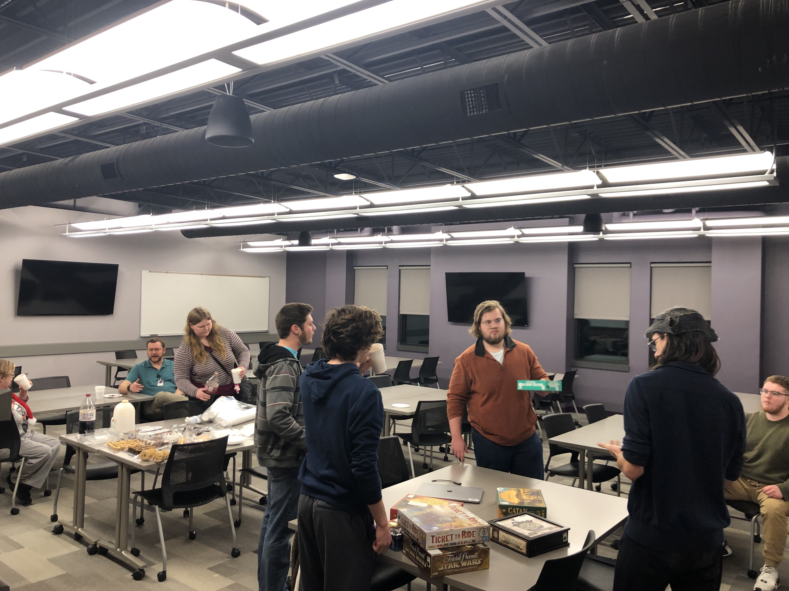
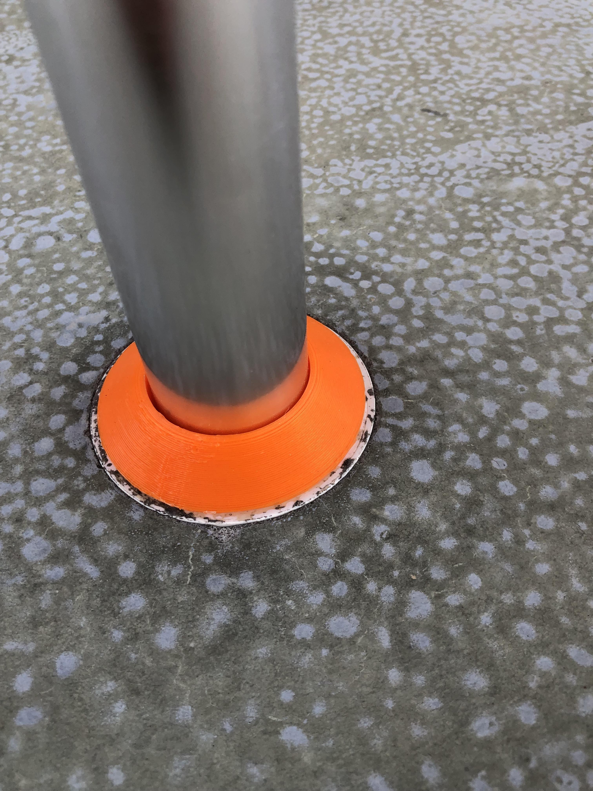
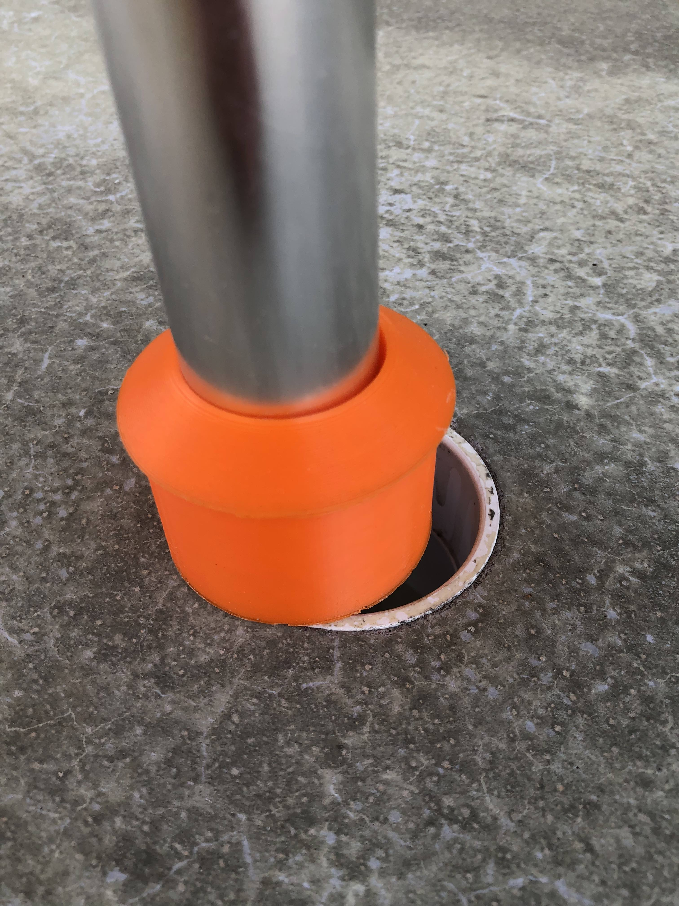

# Maker Club Meeting Minutes

## 12/13/22 Club meeting
Participants: Coleen, Josh, Elijah, Lukas, Joel, Tyler, Dr. Lu, and others as show in the following photo.

We chatted about 3D printing project. Dr. Lu showed the icecream churner he was going to print:

Elijah brought games from Coleen's collection and planned for the group to watch a movie together, but not enough people seamed interested. People just chatted while munching on some "fancy" snack and had a good time. Elijah said that he would not host our next Christmas party in finals week.

## 10/10/22 Club meeting
Participants: Coleen, Elijah, Kerby, Lukas, Joel, Michael, Deacon, Dr. Lu, and many
newcomers as shown in the following photo.

First, Elijah and Lukas show the group how to download and setup [Cura](https://ultimaker.com/software/ultimaker-cura) for slicing 3D models. Then, they gave a tour of the Maker lab with the 3D printers. Students who want to use the 3D printers should contact either Elijah or Lukas, who can be found on GroupMe .

Elijah and Lukas also helped newcomers to jump start a personalized keychain design project https://www.instructables.com/How-to-Use-TinkerCad-Keychain-Edition/

Rencently, Lukas printed the following spacers that are used to hold umbrellas in SBU homecoming!

Coleen have built the following research guide (on our library site) with tons of information about making in general and 3D printing in specific. For example, you can find library books (print or digital) on related subjects and all kinds of online resources. Please check it out.

https://libguides.sbuniv.edu/c.php?g=960724&p=7220656  
## 9/12/22 Club Meeting
Participants: Coleen, Elijah, Tyler C., Kerby, Lukas, Joel, Michael, and Dr. Lu.

The meeting toke place from 6pm to 6:30pm. The participants made the following decisions and plans:
* Elijah and Lukas were elected unanimously as the new president and the vice president
of SBU Maker Club. The term is one year and they will switch roles next year.
* Elijah and Lukas will spearhead the effort to perform a inventory check to record
the 3D printers that belong to the club, their condition (working or broken), who are using them, and
develop a policy and a procedure on how students can use them and report issues.
* Dr. Lu will help Elijah and Lukas get key access to Taylor 206B (research lab 4 for 3D printing) so that other students can contact them to schedule a time to use the 3D printers.
* Everyone will try to make it to the club fair, which starts at 6:30pm (Thursday 9/15/22). Setup starts at 6:10pm on the Forum. Everyone will bring items they have made to showcase.
* Joel will try to contact Coleen to get her 
[EasyThread K1 3D printer](https://www.easythreed.com/h-col-1492.html) to display at the club fair for its "cute" factor.
* Dr. Lu will try to get a club banner designed by SBU marketing and printed by Thursday for the club fair.
* The club plans to attend a [Fix-It Fair](https://thelibrary.org/programs/)
in Midtown Carnegie Branch Library (upstairs meeting room, on 10/8/22 noon-4 p.m.) in Springfield. If it is feasible, the club could offer similar service to the campus community. This allows the club members to use their skills to benefit others.
* Kerby suggested that a project be identified as a club project that all club members can work on.
* The club will use GroupMe for group messaging. Dr. Lu will collect phone numbers and setup the group.
